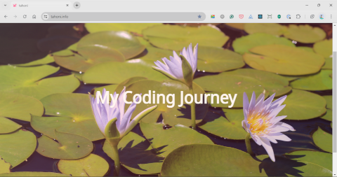

# Leoni Lubbinge's website

## Table of contents
- [Description](#description)
- [Summary](#summary)
- [Repository](#repository)
- [Structure](#structure)
- [Technology](#technology)
- [Instructions](#instructions)
- [Screenshots](#screenshots)
- [License](#license)
- [Author](#author)
- [Support](#support)

## Description
This project stores the source code for my website at https://www.tahoni.info.

## Summary
This project stores the source code for my website at https://www.tahoni.info.\
It is a React project that was bootstrapped using the Create React App utility
with the Redux Typescript.
It is written in TypeScript and uses Bootstrap and React Bootstrap 
as the UI framework.

## Repository
The repository for this project is located at 
[GitHub](https://github.com/tahoni/tahoni-web).

Feature requests, suggestions for improvements and bugs can be logged 
using the project's [Issues](https://github.com/tahoni/tahoni-web/issues) page.

The project can be found at [https://tahoni.info](https://www.tahoni.info).

## Structure
A high-level structure of the project.
```text
├───documentation
│   ├───manual
│   └───screenshots
├───public
└───src
    ├───app
    ├───assets
    │   ├───css
    │   └───img
    ├───components
    ├───features
    ├───layouts
    ├───pages
    └───posts
```

## Technology
A list of the technology used to develop and/or run the project.

**_Languages:_**
- TypeScript 5

  [](https://www.typescriptlang.org/)

- HTML 5

  [](https://www.w3.org/)

- CSS 3

  [](https://www.w3.org/)

**_Build Tools:_**
- npm

  [](https://www.npmjs.com/)

**_Frameworks:_**
- React 18

  [](https://react.dev/)

**_Libraries:_**
- Bootstrap 5

  [](https://getbootstrap.com/)

- React Bootstrap 2

  [](https://react-bootstrap.github.io/)

## Instructions
This project was bootstrapped with 
[Create React App](https://github.com/facebook/create-react-app), 
using the [Redux](https://redux.js.org/) and 
[Redux Toolkit](https://redux-toolkit.js.org/) TS template.

### Available Scripts

In the project directory, you can run:

#### `npm start`

Runs the app in the development mode.\
Open [http://localhost:3000](http://localhost:3000) to view it in the browser.

The page will reload if you make edits.\
You will also see any lint errors in the console.

#### `npm test`

Launches the test runner in the interactive watch mode.\
See the section about 
[running tests](https://facebook.github.io/create-react-app/docs/running-tests) 
for more information.

#### `npm run build`

Builds the app for production to the `build` folder.\
It correctly bundles React in production mode and optimizes the build 
for the best performance.

The build is minified and the filenames include the hashes.\
Your app is ready to be deployed!

See the section about 
[deployment](https://facebook.github.io/create-react-app/docs/deployment) 
for more information.

#### `npm run eject`

**Note: this is a one-way operation. Once you `eject`, you can’t go back!**

If you aren’t satisfied with the build tool and configuration choices,
you can `eject` anytime. This command will remove the single-build dependency
from your project.

Instead, it will copy all the configuration files and the transitive dependencies
(webpack, Babel, ESLint, etc.) into your project, so you have full control
over them. All the commands except `eject` will still work, but they will point
to the copied scripts, so you can tweak them. At this point, you’re on your own.

You don’t have to ever use `eject`. The curated feature set is suitable for 
small and middle deployments, and you shouldn’t feel obligated to use this feature. 
However, we understand that this tool wouldn’t be useful if you couldn’t customize it 
when you are ready for it.

## Screenshots
_Home page:_



## License
This project is licensed under the terms of the _MIT license_.

## Author
**Leoni Lubbinge**
- [](https://www.tahoni.info)
- [](mailto:leonil@tahoni.info)
- [](mailto:tahoni@outlook.com)
- [](mailto:tahoni@gmail.com)
- [](https://github.com/tahoni)
- [](https://www.linkedin.com/in/leoni-lubbinge-06066b16/)

## Support
Contributions, suggestions, bug reports and feature requests are welcome!

Give a ⭐️ if you like this project!
